# Mini Project: Geospatial Statistics (GNR 640) - Gridded Climate Data Product Generation and Evaluation

## Saurabh Gupta - 22b4227

## **Project Overview**
This project focuses on leveraging station-based meteorological observations to generate and evaluate gridded climate data products, specifically daily precipitation. The primary goal is to apply geospatial interpolation techniques, perform rigorous statistical assessments by comparing with independent data sources (like satellite estimates), and evaluate the performance of different interpolation models. The geographical domain for this analysis is the United States of America (USA).

This repository contains an **R-based Jupyter Notebook** (`main.ipynb`) that implements the described workflow.

## **Objectives**

1.  **Data Generation**:
    *   Generate gridded precipitation data products using station-based observations.
    *   Spatial Resolution: **Two-degree resolution**.
    *   Temporal Resolution: **Daily**.

2.  **Statistical Assessment**:
    *   Compare the generated gridded datasets with independent observation sources, particularly satellite-derived precipitation estimates.
    *   Evaluate deviations, errors, and statistical agreements between the station-based interpolated data and satellite data.

3.  **Model Performance Evaluation**:
    *   Assess the performance of different spatial interpolation models:
        *   Inverse Distance Weighting (IDW)
        *   Ordinary Kriging
    *   Recommend the most suitable model based on various accuracy metrics.

## **Datasets Used**

The project utilizes three primary datasets:

### 1. Station-Based Observations
*   **File Name**: `data/USCRN_Daily_Precipitation.csv`
*   **Source**: United States Climate Reference Network (USCRN), managed by NOAA.
*   **Description**:
    *   Contains daily precipitation time series for over 130 weather stations across the USA.
    *   The first column (`date`) represents the date and time of the observation.
    *   Subsequent columns represent unique weather stations, with values indicating daily precipitation amounts (in millimeters).
*   **Purpose**: Serves as the ground truth or reference dataset for generating interpolated gridded products and for evaluating model performance.
*   **Critical Note**: The provided `USCRN_Daily_Precipitation.csv` **does not contain latitude and longitude coordinates for the stations**. In the `main.ipynb` notebook, **dummy coordinates** are generated for demonstration purposes. For any meaningful spatial analysis, these must be replaced with actual station metadata.

### 2. Satellite-Derived U.S.-Focused Data
*   **File Name**: `data/US_Satellite_Daily_Data.csv`
*   **Source**: Satellite observations focused specifically on the United States.
*   **Description**:
    *   Contains satellite-derived geospatial data with daily time-series values for locations within the USA.
    *   Columns include `latitude`, `longitude`, and daily measurements (assumed to be precipitation) starting from **01-01-2024**.
*   **Purpose**: Acts as an independent, U.S.-focused reference dataset for comparing with station-based observations and evaluating the generated gridded data products.

### 3. Satellite-Derived Global Data (Optional/Reference)
*   **File Name**: `data/Global_Satellite_Daily_Data.csv`
*   **Source**: Satellite observations (likely derived from global remote sensing platforms).
*   **Description**:
    *   Similar to the U.S. dataset but with global coverage. Columns include `latitude`, `longitude`, and daily measurements from **01-01-2024**.
*   **Purpose**: While the project primarily uses `US_Satellite_Daily_Data.csv`, this dataset is available for broader context or if global-scale comparisons were intended. The notebook demonstrates filtering this data for the US extent.

## **Workflow and Implementation (`main.ipynb`)**

The analysis is performed in R within a Jupyter Notebook (`main.ipynb`). Key R libraries used include `readr`, `dplyr`, `gstat`, `hydroGOF`, `ggplot2`, `tidyr`, `lubridate`, `sf`, and `stars`.

### **Step 1: Data Preparation**

1.  **Environment Setup**:
    *   Checks for and installs missing required R packages.
    *   Loads all necessary libraries.

2.  **Access and Preprocess Station Observations**:
    *   Loads `data/USCRN_Daily_Precipitation.csv`.
    *   Converts the `date` column to Date objects.
    *   Reshapes the data from wide to long format (`station_data_long`), with columns for `date`, `station_name`, and `precipitation`.
    *   Filters out rows with NA precipitation.
    *   **Generates DUMMY latitude/longitude coordinates** for each unique station due to their absence in the source file. This is a critical limitation for real-world application and is highlighted in the notebook.
    *   Converts the processed station data to an `sf` (simple features) object (`station_data_sf`) for spatial analysis, using WGS84 CRS (EPSG:4326).
    *   **Visualization**: Plots the station locations on a map (using dummy coordinates).

3.  **Extract and Preprocess Satellite Estimates**:
    *   Loads `data/US_Satellite_Daily_Data.csv` and `data/Global_Satellite_Daily_Data.csv`.
    *   Preprocesses U.S. satellite data (`us_satellite_data_raw`):
        *   Reshapes data to long format (`us_satellite_long`) with `latitude`, `longitude`, `date_str`, and `satellite_precipitation`.
        *   Converts `date_str` (DD-MM-YYYY) to Date objects.
        *   Filters data from January 1, 2024, onwards.
        *   Converts to an `sf` object (`us_satellite_sf`).
    *   Optionally preprocesses global satellite data to filter for the U.S. extent (`global_satellite_us_filtered_sf`). The `us_satellite_sf` is used as the primary satellite reference.

### **Step 2: Interpolation**

1.  **Define Interpolation Grid**:
    *   A target grid for interpolation is created using the `stars` package, covering the approximate continental USA (Longitude: -125 to -67, Latitude: 25 to 49) with a **two-degree spatial resolution**.

2.  **Select Dates for Processing**:
    *   Filters unique dates from the station data, specifically focusing on a subset of up to `max_days_to_process` (e.g., 100) most recent days from the year 2020 for demonstration.

3.  **Daily Interpolation Loop**:
    *   Iterates through each selected date:
        *   Subsets station data for the current day.
        *   Skips days with insufficient data points (e.g., < 3).
        *   **Inverse Distance Weighting (IDW)**:
            *   Performs IDW interpolation (`gstat::idw`) using `precipitation ~ 1` formula and `idp = 2.0`.
            *   Handles potential errors during interpolation.
        *   **Ordinary Kriging**:
            *   Performs Kriging if sufficient data points are available (e.g., > 5).
            *   **Variogram Modeling**:
                *   Computes an empirical variogram (`gstat::variogram`).
                *   Fits a theoretical variogram model (e.g., Spherical - "Sph") using `gstat::fit.variogram`.
                *   Includes a fallback to a default variogram model if fitting fails or the model is invalid, to ensure the script can proceed.
                *   The first successfully computed empirical variogram and fitted model are stored for later visualization.
            *   Performs Kriging interpolation (`gstat::krige`) using the fitted (or default) variogram.
            *   Handles potential errors.
        *   Stores the resulting IDW (`idw_pred`) and Kriging (`kriging_pred`, `kriging_var`) grids (as `stars` objects) in a list.
        *   **Validation Data Extraction**: Extracts interpolated IDW and Kriging values at the original station locations for the current day to be used in model evaluation.

4.  **Visualize Interpolated Grids (for a sample day)**:
    *   Selects the first successfully processed day from `daily_interpolated_stars_list`.
    *   **Plots**:
        *   Map of IDW Interpolated Precipitation.
        *   Map of Kriging Interpolated Precipitation.
        *   Map of Kriging Interpolation Variance (if available).
        *   (These plots use `ggplot2` with `geom_stars` and `viridis` color scale).

### **Step 3: Performance Evaluation and Model Experimentation**

This step focuses on evaluating the interpolation models using various statistical metrics and visualizations.

1.  **Combine Predictions**:
    *   All daily station predictions (observed precipitation, IDW predictions at stations, Kriging predictions at stations) are combined into a single data frame (`all_station_predictions_df`).

2.  **Visual Comparisons at Station Locations**:
    *   **Scatter Plots**:
        *   Observed Precipitation vs. IDW Predicted Precipitation (with a 1:1 line).
        *   Observed Precipitation vs. Kriging Predicted Precipitation (with a 1:1 line).
    *   **Histograms**:
        *   Distribution of Observed Precipitation.
        *   Distribution of IDW Predicted Precipitation at stations.
        *   Distribution of Kriging Predicted Precipitation at stations.
        *   (Plotted using `ggplot2` with `facet_wrap` for separate source distributions).
    *   **Box Plots**:
        *   Comparative box plots for Observed, IDW, and Kriging precipitation values at stations.
    *   **Time Series Plots**:
        *   For a sample of stations (e.g., 3), plots time series of:
            *   Observed Precipitation
            *   IDW Predicted Precipitation
            *   Kriging Predicted Precipitation
            *   (If satellite data is processed and joined) Satellite Precipitation
    *   **Residual Plots**:
        *   **IDW Residuals (Observed - Predicted)**:
            *   Histogram of IDW residuals.
            *   Scatter plot of IDW Predicted Precipitation vs. IDW Residuals.
        *   **Kriging Residuals (Observed - Predicted)**:
            *   Histogram of Kriging residuals.
            *   Scatter plot of Kriging Predicted Precipitation vs. Kriging Residuals.

3.  **Comparison with Satellite Data**:
    *   Extracts satellite precipitation estimates (`us_satellite_sf`) at station locations for the corresponding dates. This involves finding the nearest satellite pixel to each station for each day.
    *   Joins these satellite estimates with `all_station_predictions_df`.
    *   **Scatter Plot**:
        *   Observed Precipitation vs. Satellite Precipitation at stations (with a 1:1 line).

4.  **Calculate Goodness-of-Fit Metrics**:
    *   The notebook cells will also calculate and print the following Goodness-of-Fit metrics using the `hydroGOF` package. These textual results provide quantitative insights into model performance:
        *   **Root Mean Square Error (RMSE)**
        *   **Mean Absolute Error (MAE)**
        *   **R-squared (R²)**
    *   These metrics are calculated for:
        *   IDW predictions vs. Observed
        *   Kriging predictions vs. Observed
        *   Satellite estimates vs. Observed
    *   **Bar Plot**:
        *   Comparison of RMSE values across IDW, Kriging, and Satellite models.

    #### Example Textual Output of Metrics (Placeholder):

    When the `main.ipynb` notebook is run, the R code cells responsible for calculating these metrics will print output to the console/cell output area. The format will be similar to the following:

    ```text
    --- Goodness-of-Fit Metrics ---
    IDW - RMSE: 4.976 , MAE: 1.915 , R-squared: 0.67
    Kriging - RMSE: 6.74 , MAE: 2.981 , R-squared: 0.387
    ```

5.  **Plot Sample Variogram**:
    *   If a sample empirical variogram and fitted model were stored during the interpolation step:
        *   Plots the empirical variogram (points) and the fitted variogram model (line).

### **Step 4 & 5: Statistical Analysis & Seasonality Analysis (as per `project.md`)**

While `project.md` outlines further steps like detailed central tendency/dispersion analysis, Kolmogorov-Smirnov tests, and seasonality analysis, the current `main.ipynb` primarily focuses on the interpolation and its direct evaluation. These could be future extensions.

### **Step 6: Model Suitability (as per `project.md`)**

The notebook provides quantitative metrics (RMSE, MAE, R²) and visualizations that form the basis for recommending the best model. The bar plot of RMSE offers a direct comparison.

## **Key Visualizations Produced by `main.ipynb`**

Upon running the `main.ipynb` notebook, the cells will output a rich set of visualizations using `ggplot2`. These are crucial for understanding the data and model performance and include:

1.  **Station Locations Map**:
    *   Shows the (dummy) spatial distribution of weather stations.
    *   _This is a `geom_sf` plot generated by `ggplot2` in an early cell of the notebook, typically after loading and initially processing station data._

    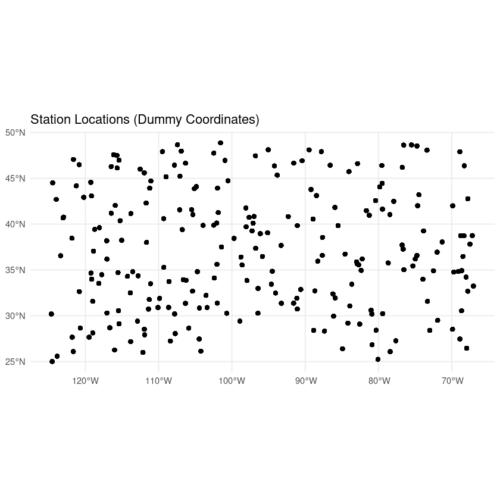

2.  **Interpolated Precipitation Maps**: For a sample day:
    *   IDW interpolated precipitation grid.
    *   Kriging interpolated precipitation grid.
    *   Kriging interpolation variance grid.
    *   _These are `geom_stars` plots generated by `ggplot2` after the daily interpolation loop, visualizing the output for the first successfully processed day._

    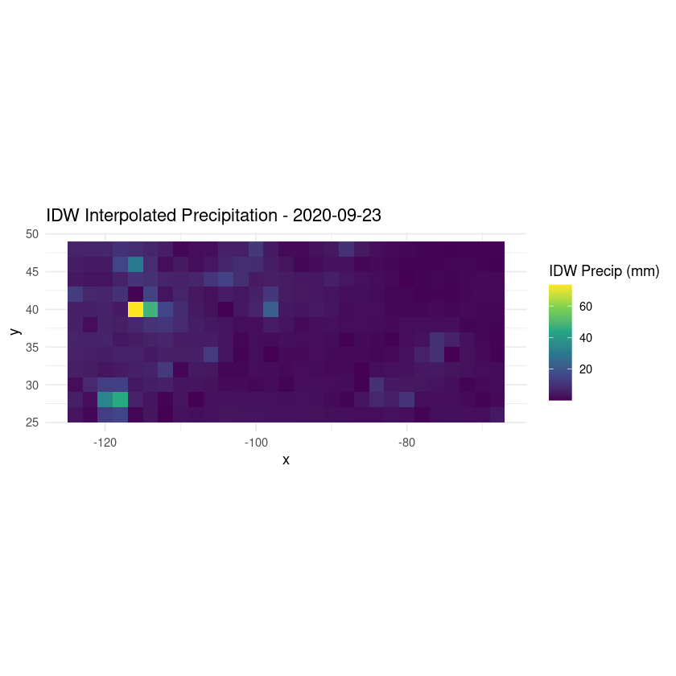
    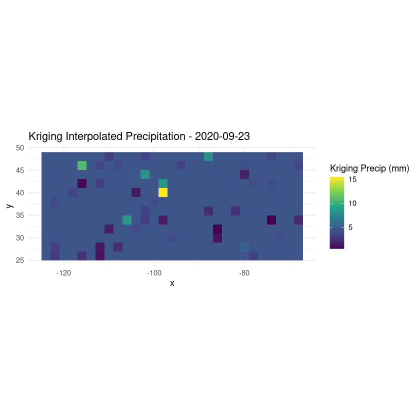
    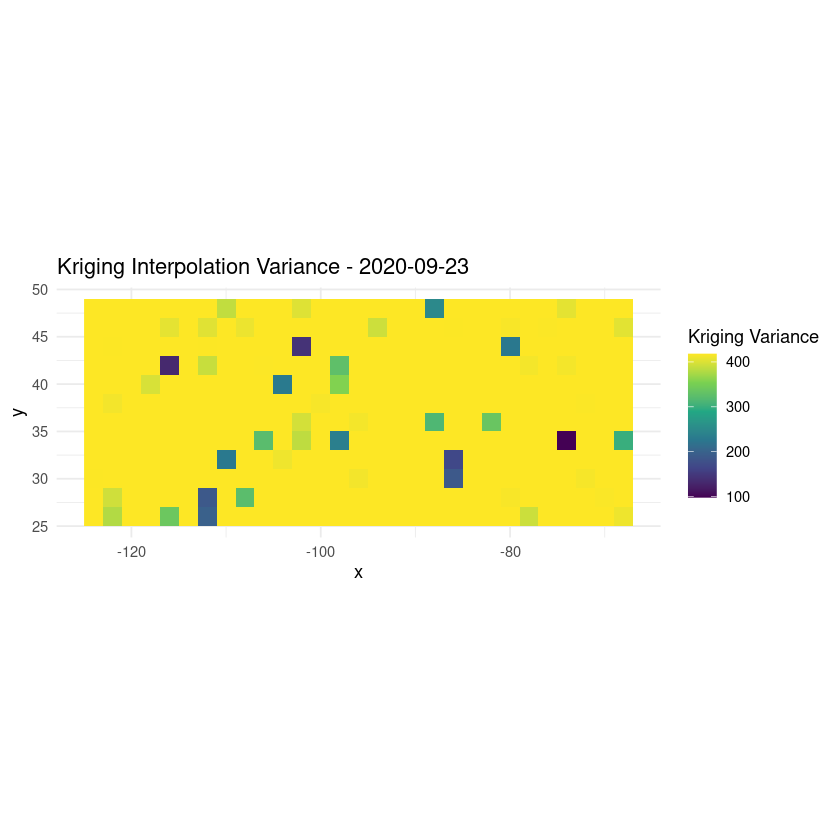

3.  **Observed vs. Predicted Scatter Plots**:
    *   Observed vs. IDW at station locations.
    *   Observed vs. Kriging at station locations.
    *   Observed vs. Satellite at station locations.
    *   _These are scatter plots (`geom_point`) with a 1:1 reference line (`geom_abline`), generated by `ggplot2` in the performance evaluation section, using the combined station predictions._

    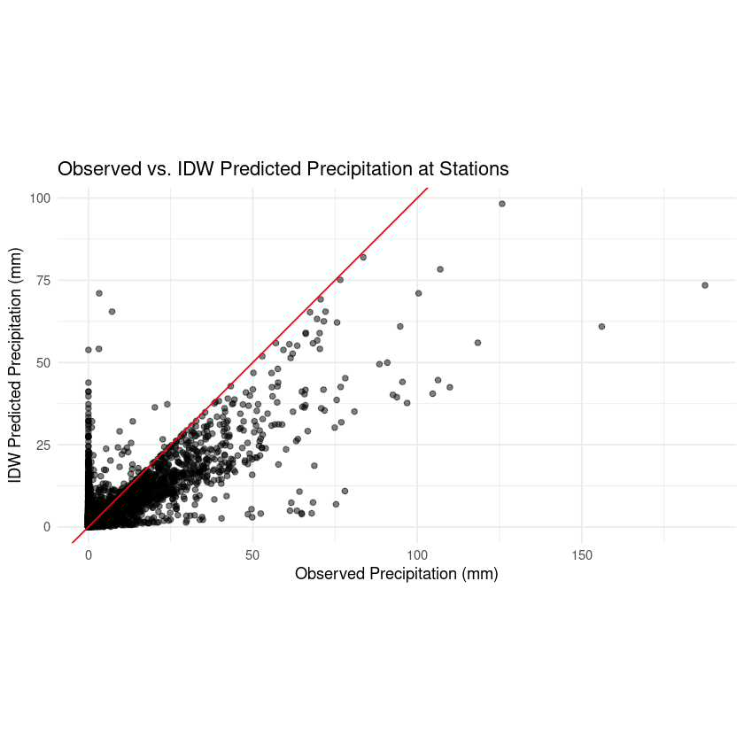
    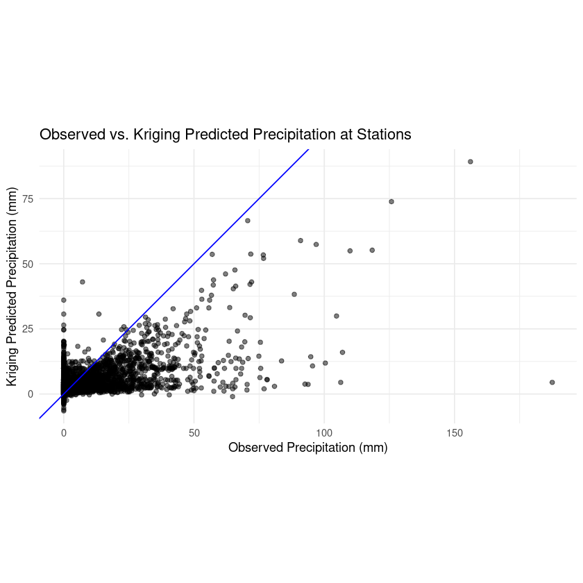

4.  **Distribution Plots**:
    *   Histograms of observed, IDW-predicted, and Kriging-predicted precipitation.
    *   Box plots comparing these distributions.
    *   _These are `geom_histogram` and `geom_boxplot` plots generated by `ggplot2`, often using `facet_wrap` to show distributions side-by-side for comparison._

    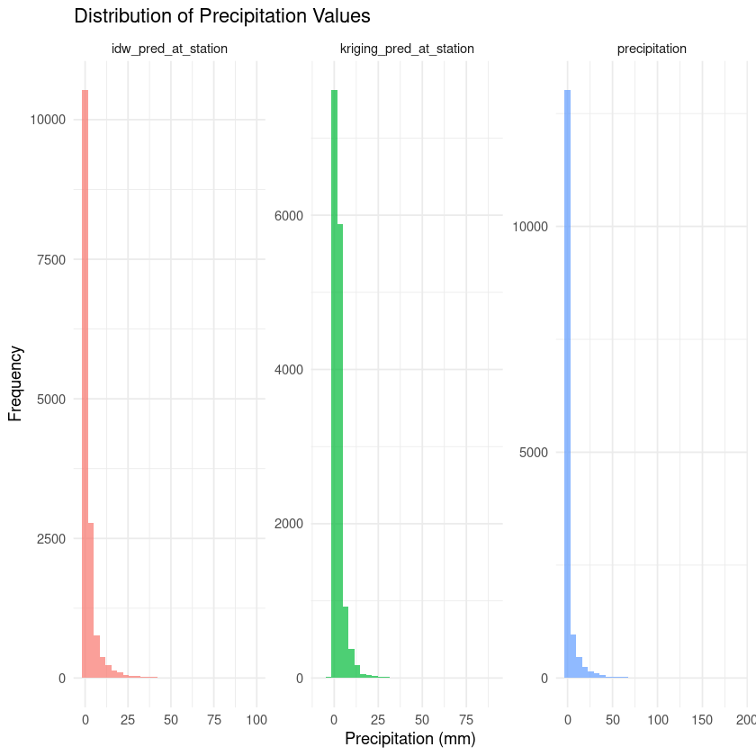
    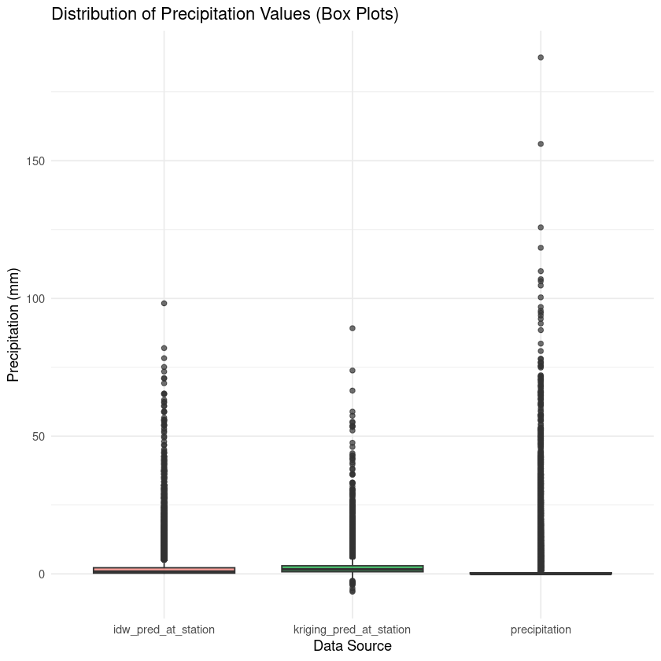

5.  **Time Series Plots**:
    *   For selected stations, comparing observed precipitation with IDW, Kriging, and satellite estimates over time.
    *   _These are line plots (`geom_line` and `geom_point`) generated by `ggplot2`, typically faceted by station name, to visualize temporal trends and model agreement for a few sample stations._

    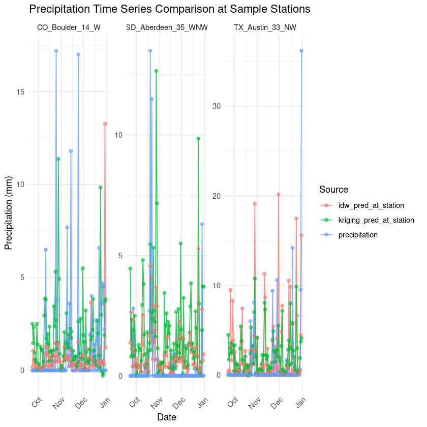

6.  **Residual Analysis Plots**:
    *   Histograms of IDW and Kriging residuals (Observed - Predicted).
    *   Scatter plots of predicted values vs. residuals for IDW and Kriging.
    *   _These include `geom_histogram` for residual distributions and `geom_point` scatter plots (predicted vs. residuals with a horizontal line at y=0) generated by `ggplot2` to assess model bias and error patterns._

    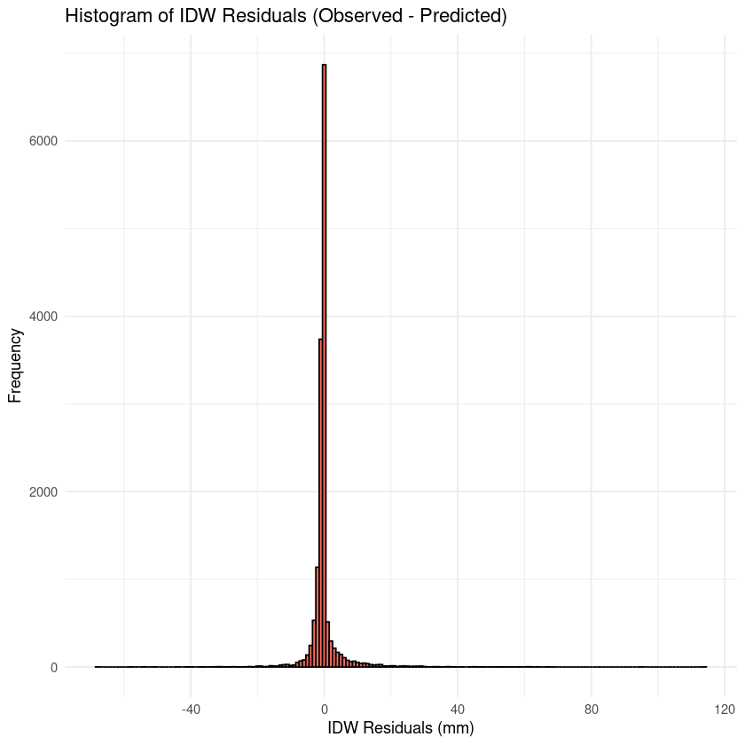
    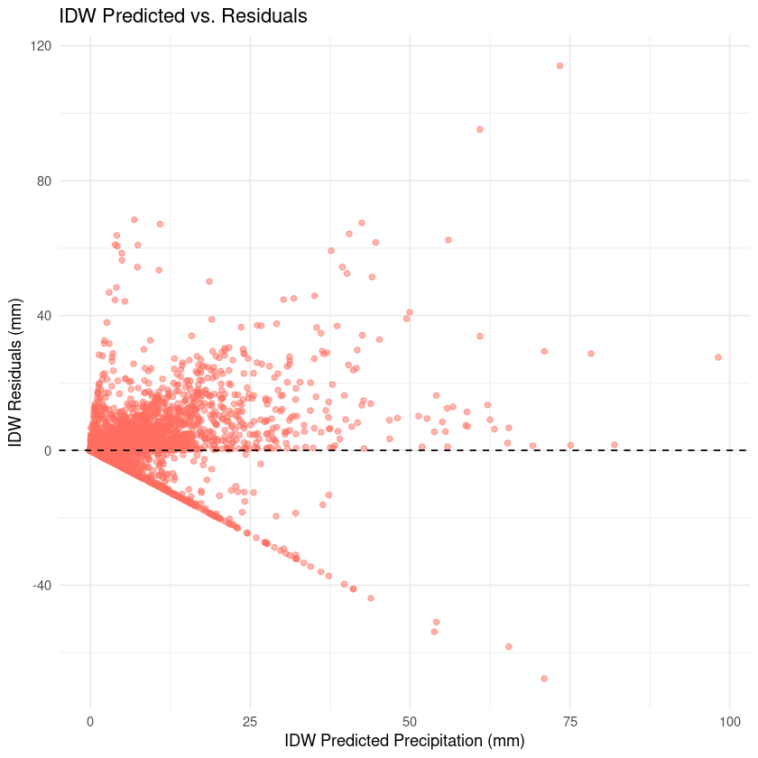
    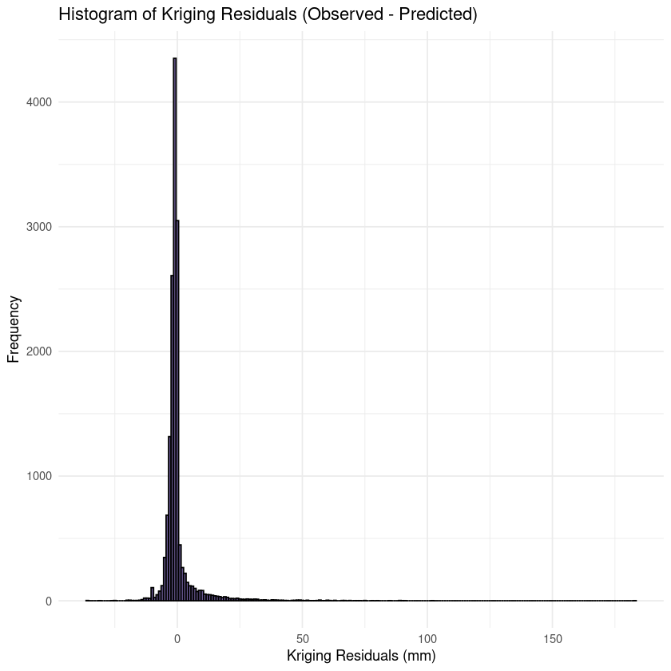
    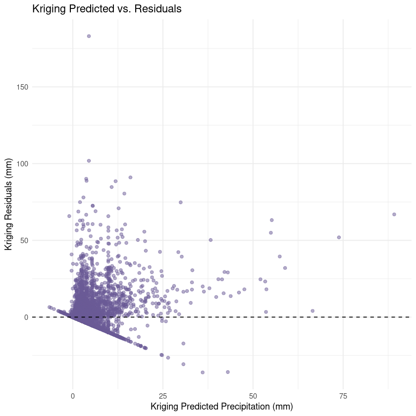

7.  **RMSE Comparison Bar Plot**:
    *   Visual summary of RMSE for IDW, Kriging, and Satellite models.
    *   _This is a `geom_bar` plot generated by `ggplot2`, providing a direct visual comparison of the Root Mean Square Error across the different modeling approaches._

    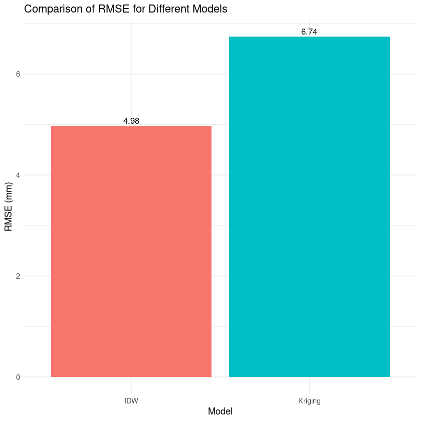

8.  **Sample Variogram Plot**:
    *   Shows the empirical variogram (points) and the fitted variogram model (line) for a sample day used in Kriging.
    *   _This plot, generated by `ggplot2`, visualizes the spatial correlation structure (semivariance vs. distance) captured by the variogram model for one of the processed days._

    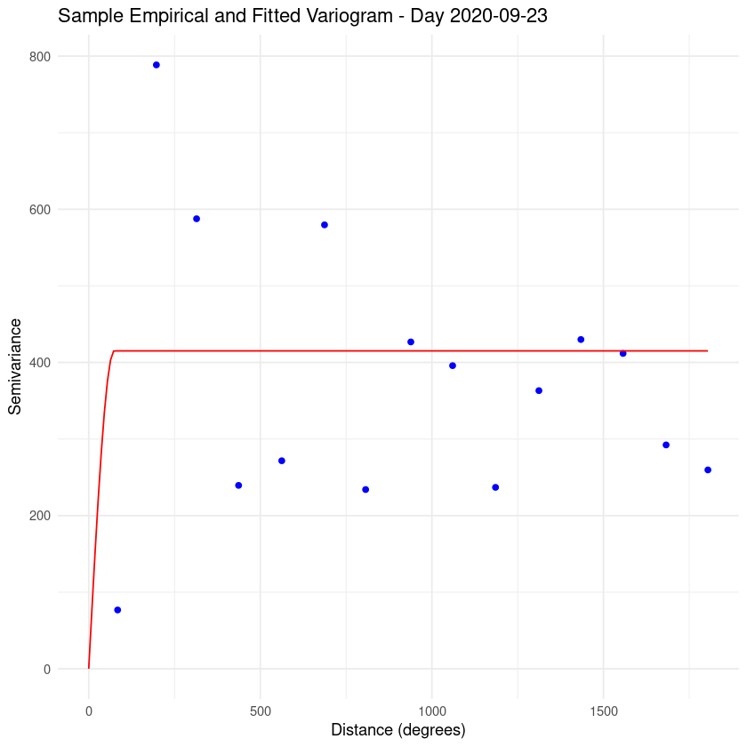


## **How to Run**

1.  Ensure you have R and Jupyter Notebook/JupyterLab installed.
2.  Install the required R packages listed in the first code cell of `main.ipynb`:
    `readr`, `dplyr`, `gstat`, `hydroGOF`, `ggplot2`, `tidyr`, `lubridate`, `sf`, `stars`.
    The notebook includes a script to check and install missing packages.
3.  Place the data files (`USCRN_Daily_Precipitation.csv`, `Global_Satellite_Daily_Data.csv`, `US_Satellite_Daily_Data.csv`) in a `data/` subdirectory relative to the notebook.
4.  Open and run the `main.ipynb` notebook.

## **Important Notes and Limitations**

*   **Station Coordinates**: The most significant limitation is the use of **DUMMY coordinates** for stations in `USCRN_Daily_Precipitation.csv`. For any meaningful real-world application or accurate spatial analysis, this notebook **must be updated with actual station latitude/longitude data**.
*   **Temporal Scope**: The analysis in the notebook is demonstrated over a selected period (a subset of days from 2020 for interpolation). For a comprehensive study, interpolation and evaluation should cover all relevant days, years, and seasons.
*   **Variogram Modeling**: Kriging's performance is highly dependent on accurate variogram modeling. The automated fitting in the notebook uses a basic approach with a fallback to a default model. Careful, possibly manual, variogram analysis for different regions or time periods is crucial for optimal Kriging results.
*   **Cross-Validation**: For a more robust evaluation of model performance, implementing spatial cross-validation techniques (e.g., k-fold or leave-one-out cross-validation) is recommended. The current evaluation is based on extracting interpolated values at the same points used for interpolation, which can be optimistic.
*   **Computational Cost**: Kriging, especially with daily variogram fitting and interpolation over many points and time steps, can be computationally intensive. The `max_days_to_process` variable limits the scope for demonstration.
*   **Satellite Data Extraction**: The method for extracting satellite data at station locations (nearest neighbor) is a simplification and can be computationally intensive for large datasets. More sophisticated raster sampling or spatial join techniques might be more efficient.

## *Deliverables*

1.  **Gridded Data Products**: The notebook generates daily gridded precipitation data (IDW and Kriging) at a two-degree spatial resolution, stored in `daily_interpolated_stars_list`. These can be exported if needed.
2.  **Performance Report**: This README, along with the `main.ipynb` notebook (which includes outputs, visualizations, and metrics), serves as a detailed performance report.
3.  **Code Documentation**: The `main.ipynb` notebook is commented to explain the R code for data preprocessing, interpolation, and analysis.

---
